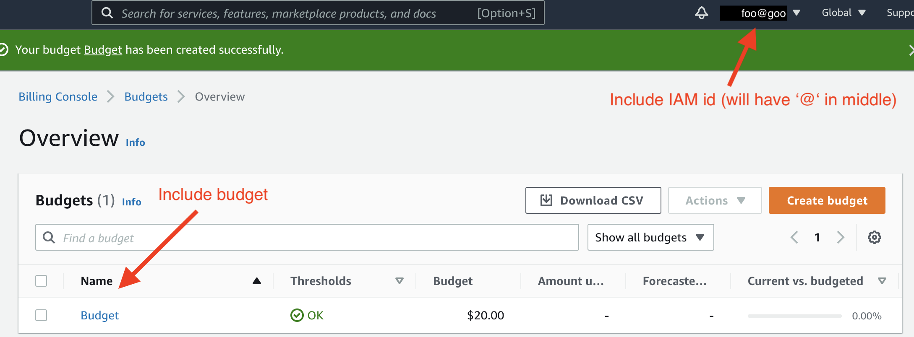

# Introduction

This exercise sets up your cloud accounts on AWS and Azure.

# Amazon Web Services

## Do you already have an AWS id?

Even though you already have an AWS userid you may not have set up all
the features we need for this course:

* AWS root user
* IAM administrative user (& key pair)
* EC2 ssh key pair
* Budget alert

If you have not already set up any of these, skip to the
appropriate section below.

## Sign up for AWS

If you do not already have an AWS account, go to
[aws.amazon.com](https://aws.amazon.com/) and click `Create an AWS
Account`.  You will need a credit card number to complete the
process. Note that AWS accepts prepaid credit cards, if you do not
have a Canadian credit card.

See
[How do I create and activate a new AWS account?](https://aws.amazon.com/premiumsupport/knowledge-center/create-and-activate-aws-account/)
for detailed instructions. For support plans, select the free "Basic
Support" plan.

**We strongly recommend setting
  [Multi Factor Authentication (MFA)](https://docs.aws.amazon.com/IAM/latest/UserGuide/id_credentials_mfa.html)
  on your AWS root user account.**

## Set up an IAM user with full administrative privileges

The AWS account you set up in the previous step is the
[root user](https://docs.aws.amazon.com/IAM/latest/UserGuide/id_root-user.html). This
user has total control over your account. *Use the root user
sparingly.* Really, you only need to use it once, to set up an "IAM
administrative user".  This id will have the same high privileges
as your root user but if this id is compromised you can sign in to
your root user and disable it. Of course, for the administrative
user to actually provide a second level of security, **the IAM
administrative user must have a different password from your root
user.**

Follow Amazon's instructions for
[how to create your IAM administrative user](https://docs.aws.amazon.com/IAM/latest/UserGuide/getting-started_create-admin-group.html).

**As with the root user, we strongly recommend setting
  [Multi Factor Authentication (MFA)](https://docs.aws.amazon.com/IAM/latest/UserGuide/id_credentials_mfa.html)
  on your IAM administrative account.**

### Create an access key pair 

Finally, you need an access key pair for this IAM administrative user. Follow Amazon's instructions to
[create an access key pair](https://docs.aws.amazon.com/IAM/latest/UserGuide/id_credentials_access-keys.html). This key pair will be used with the AWS CLI. Refer to this [gist](https://gist.github.com/overcoil/4d0bf31d8a9c8f4ec6f58b2bd289668f) to configure your AWS CLI. (Creating the second profile "root" for your root AWS account is optional.)

## Create an EC2 ssh key pair

You will also need an EC2 key pair for SSHing into the master node of
your EMR Spark cluster. 

**Perform this step on a private computer (e.g., your personal laptop), not a publicly-shared
  machine (e.g., a CSIL workstation). You will be downloading a private key that will serve as
  your identification to AWS machine instances.**

1. Sign on using your IAM administrative user.
2. Type `key pair` into the service search bar at the top of the page.
3. Click on `Key pairs` (around the middle of the search results,
   under `Features`).
4. If you have at least one key pair in the list, you do not need to
   do anything more.
5. If the list is empty, click `Create key pair` (top right)
6. In the "Create key pair" dialog:

   * Name (Text): *Enter a name* (You might include "AWS" in the name
     to remind you of the key's purpose)
   * Key pair type (Radio button): RSA [Default]
   * Private key file format (Radio button):
     [Pick the type appropriate for the SSH tool you use; most times that's OpenSSH]
   * Tags: [None needed]

   Click `Create key pair`.

**The private key will be downloaded to your machine.**

On your machine, do the following:

1. Choose a location to store your private key. You can either create a directory for storing this or use ssh's default hidden directory (~/.ssh). If you choose to create a directory, set the access modes so
   that only you have access. In Linux/macOS, the command is

   ~~~
   chmod go-rwx <DIRNAME>
   ~~~

2. Move the key file from the download directory to your chosen directory location.
3. Set the access modes on the key file so that only you have access.
4. Set the access modes on the key file so that even you cannot
   modify it. In Linux/macOS, the command is

   ~~~
   chmod u-w <KEYFILENAME>
   ~~~

You're almost done! There's one more step, which will help you avoid
getting nasty surprises on your credit card bill.

## Set a budget alert

In this final step, you will set up an alert so that AWS emails you
whenever your monthly bill has gone above a specified limit. Note that AWS bills in USD though its dashboard does perform dynamic currency conversion to show an approximation of your charge in the local currency. (The charge to your credit card remains in USD though.) We
suggest a limit of USD20 but you can set any value you find
comfortable.  These alerts are useful if you forget to turn a service
off and leave it running&mdash;AWS will alert you that you're racking
up unexpected charges. There are also mobile apps (for [iOS](https://apps.apple.com/us/app/aws-console/id580990573) and [Android](https://play.google.com/store/apps/details?id=com.amazon.aws.console.mobile&hl=en_US)) to monitor and manage EC2 and S3. (The app only manages a subset of AWS services.)

0. Sign on using your IAM administrative user.
1. Type `budget` in the service search bar at the top of the page.
2. Click `AWS Budgets`.
3. Click `Create a budget`.
4. Select `Cost budget` radio button [Default].  Click `Next`.
5. In the "Set budget amount" step:

   * Period (Dropdown): `Monthly` [Default]
   * Effective date (Radio button): `Recurring Budget` [Default]
   * Start month (Date): *Current month* [Default]
   * Choose how to budget (Radio button): `Fixed` [Default]
   * Enter your budgeted amount (Text): *Threshold for the alert: $20 US is a good start*
   * Budget name (Text): *Name*

   Click `Next`.
6. In the "Configure alerts" step:

   * Click `Add an alert threshold`
   * Threshold (Numeric): 100%
   * Trigger (Dropdown): `Actual` [Default]
   * Email recipients (Text): *Enter your email*

   Click `Next`.

7. In the "Attach actions" step:
   * Do not add any actions---click `Next`.

8. In the "Review" step"
   * Review your settings and if correct, click `Create budget`.

   * If you'd like you can set multiple levels of budget alerts. For this assignment, you are required to set at least one.

# Microsoft Azure

Refer to the short [gist](https://gist.github.com/overcoil/63f5131fd81a5b8810dcc4374d5e73e0) on setting up your Azure acount. You will be using Azure sparingly in this course so the setup is barebone.

# Google Cloud Platform

I have left the setup for GCP as an exercise at this time.

# Submission

Take a screen shot of your Budgets Overview. Your screen shot should
include both the budget and the IAM userid in the top right corner, as
highlighted in the following screen shot.  You do not need to add the
highlights to your screen shot.

Submit your screen shot to [Assignment 0](http://www.sfu.ca).
