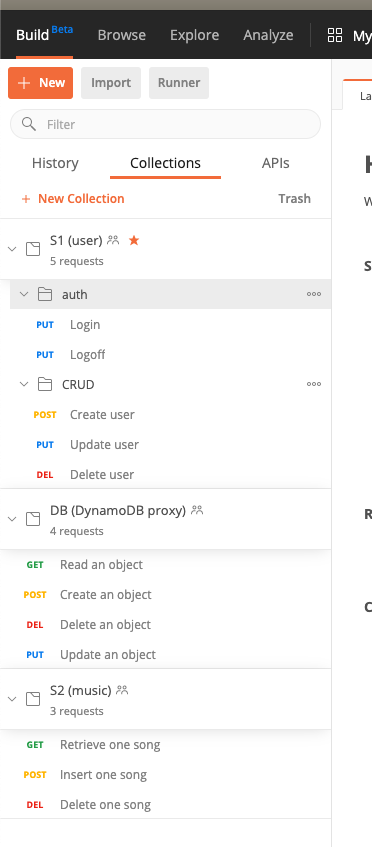

## Introduction

BLERG See [here](https://dzone.com/articles/container-registriesa-battle-royale) for an introduction to container registries.

**Please refer to the [Exercise 3 FAQ](https://docs.google.com/document/d/1A5-n71llg8PMa_l7O5BG0_kU-A6xGIHLgnsjbLd3emw/edit?usp=sharing) for up-to-date answers on common problems. I will update them continually as new information rolls in.**

This exercise continues from where you left off with AWS a few weeks ago. This exercise introduces a simple containerized micro-services application featuring a `User` table and a `Music` table. The application is
organized as a suite of three microservices and one external PaaS service:

* `cmpt756s1` (or just `s1`) reads, updates, and writes the `User` table by calling `cmpt756db`
* `cmpt756s2` (or just `s2`)  reads, updates, and writes the `Music` table by calling `cmpt756db`
* `cmpt756db` (or just `db`), the low-level database interface, calls
  DynamoDB to record the data
* AWS DynamoDB, an external PaaS service, stores the application's data in pre-defined tables

The three microservices run inside a container-hosting environment.

* Each microservice is a freestanding Python program, calling each
  other via REST interfaces implemented over HTTP.
* Each Python program is encapsulated into a Docker container images.

Bear in mind the application uses DynamoDB key-value store which runs on AWS. The `cmpt756db`
service will have to establish connections to Amazon to read
and write the two tables.

You will be using this application throughout this course as a representative application to explore various techniques and approaches to working with cloud-native application.

The following diagram illustrates all the components of the final application. This exercise will focus in on a subset of the application: just the two microservices `s1` and `db`.


## 1. CloudFormation tutorial

Read thru AWS' [doc](https://docs.aws.amazon.com/AWSCloudFormation/latest/UserGuide/GettingStarted.Walkthrough.html). In AWS terminology, _stacks_ represent a set of resources (e.g., users, machines, databases, etc) that you manage atomically.

AWS CloudFormation is one of several options provided by Amazon to implement _infrastructure as code_ (IaC). (See [OpsWork](https://aws.amazon.com/opsworks/) and [Elastic Beanstalk](https://aws.amazon.com/elasticbeanstalk/).) CloudFormation is less prescriptive while the other options are targeted at specific types of applications.

Each public cloud vendor have their own comparable technology ([GCP's Deployment Manager](https://cloud.google.com/deployment-manager), [Azure Resource Manager](https://docs.microsoft.com/en-us/azure/azure-resource-manager/management/overview)). There are also open-source options including [Terraform](https://www.terraform.io/) which support multiple cloud technologies.


## 2. Containers

In this exercise, you will practice running services manually. We will be using Docker for this. If you are unfamiliar or require a review of Docker, refer to this [architectural overview](https://docs.docker.com/get-started/overview/#docker-architecture).

You will exercise these services by building these container images, saving (pushing) them into a container registry and running the images.


1. Start by pulling the code for this exercise and refer to the ``e-k8s`` subdirectory:

```bash
$ git clone https://github.com/scp-2021-jan-cmpt-756/sfu-cmpt756.211
```

We will be using a very small amount of material here. For clarity, this is an
abbreviated description of the material that you will touch in Exercise 4.

| directory/file | Note |
|-|-|
| e-k8s/s1/ | the User service |
| e-k8s/db/ | the database writer service |
| e-k8s/postman/ | the API definition collection |
| e-k8s/cluster/ | material for working with a Kubernetes cluster |
| e-k8s/logs | all output files are collected here |
| e-k8s/tools | misc tools to prepare repo content (makefiles) for use |
| e-k8s/docker.mak | instantiated makefile to work with Docker |

The exercises for 756 is organized around a set of makefile to simplify and to introduce the various tools. If you aren't familiar with makefile or the make tool, refer [here](https://www.gnu.org/software/make/manual/html_node/Introduction.html).


2. Fill in the required values in the template variable file

Copy the file `cluster/tpl-vars-blank.txt` to `cluster/tpl-vars.txt`
and fill in all the required values in `tpl-vars.txt`.  These include
things like your AWS keys, your GitHub signon, and other identifying
information.  See the comments in that file for details.

Beware that each of the values you supply must **not** contain any spaces (which will break the script). This is
a possibility for JAVA_HOME or your Gatling install directory where a directory along the path may have a space.
You will need to either escape the space or move the content.

**Important: if you are using an AWS starter account, be sure to fill in the session token. The starter account's session token  expires periodically (about an hour) so you will need to reinstantiate the templates periodically. If you are using a standard account, leave the field empty.**


3. Instantiate the templates

Once you have filled in `tpl-vars.txt`, run

~~~
$ make -f k8s-tpl.mak templates
~~~

**Whenever you update your session token, update `cluster/tpl-vars.txt` and re-run the command above to propagage the change into your environment.**

This will check that all the programs you will need have been
installed and are in the search path.  If any program is missing,
install it before proceeding.

The script will then generate the instantiated makefiles (as indicated above) that you can use to operate your environment.

**Note:** This is the *only* time you will call `k8s-tpl.mak`
directly. Do not call/use the `-tpl.mak` files.


## 3. Setup DynamoDB tables

The db service requires the creation of some DynamoDB tables. This setup is done using AWS Cloudformation.

Run the following command from the `e-k8s/cluster` folder (being careful to append your SFU-ID):

```
aws cloudformation create-stack --stack-name db-<SFU-ID> --template-body file://cloudformationdynamodb.json
```

If you are already familiar with Cassandra or another key-value store, DynamoDB will be very easy to pick up. See [here](https://aws.amazon.com/getting-started/hands-on/create-nosql-table/) for a quick intro.


## 4. Setup Postman environment

Navigate to [Postman](https://www.postman.com) and create an account. (We will be using Postman to quickly exercise the API
provided by the containers to verify their correction operation.) Download and install the desktop client. (You can use the web client though that requires the installation of a supporting plug-in.)

Import `postman/S1-user.postman_coll.json` and `postman/DB.postman_coll.json` from the repo into your account. Your account will look similar to this (you can ignore the S2 service):



You can use Postman directly to initiate requests by filling in a request per the API contract in section 7 below. Alternately, Postman can [generate the appropriate code/command-line](https://learning.postman.com/docs/sending-requests/generate-code-snippets/) for other tools. In particular, it supports [curl](https://en.wikipedia.org/wiki/CURL) which can be used from a Linux shell.


You can also choose to use curl directly to invoke the API.


## 5. Run the services


1. Build your images:

```script
make -f docker.mak s1
```

If you examine `docker.mak`, you will find that the pseudo-target `s1` ultimately reduces down to:

```script
docker build -t ghcr.io/<registry-id>/cmpt756s1:e3 s1
docker push ghcr.io/<registry-id>/cmpt756s1:e3
```

(There are parameter substitutions which may obfuscated but you can see the final command as issued in your terminal.)

Refer to the documentation for [build](https://docs.docker.com/engine/reference/commandline/run/) and [push](https://docs.docker.com/engine/reference/commandline/push/). Note that we are using GitHub's container registry (`ghcr.io`) and not the typical DockerHub.

Repeat this for db with `make -f docker.mak db`.

2. Run your images:

```script
make -f docker.mak deploy
```

which reduces to the two commands:

```script
docker run -t --publish hport:cport --detach --name s1 ghcr.io/<registry-id>/cmpt756s1:e3
docker run -t \
		-e AWS_REGION="us-...-2" \
		-e AWS_ACCESS_KEY_ID="AK.....PQBTYA" \
		-e AWS_SECRET_ACCESS_KEY="wKh......R71kWpEqwYPWx6U+" \
		-e AWS_SESSION_TOKEN="...." \
            --publish hport:cport --detach --name db ghcr.io/<registry-id>/cmpt756db:e3
```

This looks worse than it really is so be sure to read up the [docker run documentation](https://docs.docker.com/engine/reference/commandline/run/).

(The important element is in the second `docker run` where your various secret/tokens are injected via the `-e` option. When you update your `tpl-vars.txt` and re-run `make -f k8s-tpl.mak templates`, your new token is updated.)

I also highlight the 'hport:cport' as a mapping of the port from the container's host (your machine) to the container. For this exercise, we map the ports directly with no translation.

Finally, each service (s1 and db) is mapped to a distinct port in this assignment and use docker's internal local host for each service (refer [`s1/appd.py`](https://github.com/scp-2021-jan-cmpt-756/sfu-cmpt756.211/blob/master/e-k8s/s1/appd.py), line 35). In this fashion, the services occupy different ports & readily interact with each other without the need for a cluster. Don't worry if this doesn't make sense just yet... it will further along in the course.

3. You can examine your running containers with [``docker container ls``](https://docs.docker.com/engine/reference/commandline/container_ls/); stop one with [``docker container kill``](https://docs.docker.com/engine/reference/commandline/container_kill/); and destroy one with [``docker container rm``](https://docs.docker.com/engine/reference/commandline/container_rm/). Practice stopping, destroying and restarting your containers. When you are ready to continue, ensure that you have the two services up and running by checking ``docker container ls``. If you have Docker Desktop installed, it includes [a handy Dashboard](https://docs.docker.com/desktop/dashboard/) to do the same and more.

The makefile is setup to automate the execution of some commands.

Use `scratch` to stop the containers. (You still need to `docker rm` to dispose of the containers.)

```script
$ make -f docker.mak scratch
```

Note how the makefile uses `docker ps` to look up the container id and pass it to a subsequent `docker stop`.


4. Navigate to the [DynamoDB Console](https://docs.aws.amazon.com/amazondynamodb/latest/developerguide/ConsoleDynamoDB.html) and verify that you have the two tables (user & music). Do a screen capture of each empty table.

5. Create 3 users by using service S1 and save away their user_id. A successful call will return a `user_id` suitable for referencing this user subsequently.

```
{"user_id":"23539348-1e9a-451b-938f-bdd41cd90ced"}
```


6. Login to the service by using service S1 and insert a previously-saved `user_id` into the request's body. Save away the returned login context.
```
{
	"uid": <a previously saved user_id>
}
```

(Note that this is a toy example of an authentication service; it's not appropriate for anything other than course exercises.)


## 6. Test API operation

1. Delete 1 of your 3 users by referencing its user_id and using a login context. Save the URL for this deletion operation and do a screen capture of the User table from DynamoDB after the deletion.


2. Update the record for 1 of your 2 remaining users and using a login context. Save the URL for this update operation and do a screen capture of the User table from DynamoDB after the update.


## 7. Service Specification

Following is the specification for the S1 and DB endpoints included with this exercise's sample code.

Version: v1

Service: Users

Visibility: Public

Domain: Users

Serialized Data/Content-Type: json/xml

| API                                 | Description     | Request Body/Parameters                                      | Response Body                                            | HTTP Response Code | Error Codes | Request Example                            | Response Example                 |
| ----------------------------------- | --------------- | ------------------------------------------------------------ | -------------------------------------------------------- | ------------------ | ----------- | ------------------------------------------ | -------------------------------- |
| PUT - /api/v1/user/login            | Login           | JSON:{"uid": user_id}                                        | Hash of user context suitable for passing to other calls | 200                | 500         | PUT https://host:30000/api/v1/user/login    | {“UserContext”: “<somehash>”}    |
| PUT - /api/v1/user/logoff           | Logoff          | JSON: {"jwt": token}                                         | None                                                     | 200                | 500         | PUT https://host:30000/api/v1/user/logoff   | { Message: ok }                  |
| PUT - /api/v1/user/user_id    | UPDATE one user | Body:  { Email: string, Fname: string }                      | OK response                                              | 200                | 500         | PUT https://host:30000/api/v1/user/5f761f85-53df-4e72-8414-9fe0d58779d1    | { Message: ok }                  |
| POST - /api/v1/user/                | CREATE one user | Body:  { Email: string, Fname: string Lname: string } Params: None | { “uid”: string }                                        | 200                | 500         | POST https://host:30000/api/v1/user         | { ResponseMetadata: { … etc. } } |
| DELETE - /api/v1/user/user_id | DELETE one user |                                                              | JSON of response from aws                                | 200                | 500         | DELETE https://host:30000/api/v1/user/5f761f85-53df-4e72-8414-9fe0d58779d1 | { ResponseMetadata: { … etc. } } |
| GET - /api/v1/user/user_id    | GET one user    |                                                              | JSON of User entity                                      | 200                | 500         | GET https://host:30000/api/v1/user/5f761f85-53df-4e72-8414-9fe0d58779d1    | {User Object}                    |


Version: v1

Service: Datastore

Visibility: Private

Domain: Datastore

Serialized Data/Content-Type: json/xml

| API                                | Description      | Request Body/Parameters                           | Response Body        | HTTP Response Code | Error Codes | Request Example                                              | Response Example                                             |
| ---------------------------------- | ---------------- | ------------------------------------------------- | -------------------- | ------------------ | ----------- | ------------------------------------------------------------ | ------------------------------------------------------------ |
| GET - /api/v1/datastore/read       | Read an object   | Param: object-type, object-key                    | JSON of aws response | 200                | 500         | GET https://host:30002/api/v1/datastore/read?objtype=user&objkey=123 | {   "Count": 1,   "Items": [     {       "email": "sholmes@bakers.org",       "fname": "Sherlock",       "lname": "Holmes",       "user_id": "9b235bcb-0d10-415f-ab9f-9ce23da2a119"     }   ],   "ResponseMetadata": {     "HTTPHeaders": {       "connection": "keep-alive",       "content-length": "165",       "content-type": "application/x-amz-json-1.0",       "date": "Sat, 12 Sep 2020 18:16:15 GMT",       "server": "Server",       "x-amz-crc32": "196980578",       "x-amzn-requestid": "AOGKN903DF66VLU3GEBEEO8DK3VV4KQNSO5AEMVJF66Q9ASUAAJG"     },     "HTTPStatusCode": 200,     "RequestId": "AOGKN903DF66VLU3GEBEEO8DK3VV4KQNSO5AEMVJF66Q9ASUAAJG",     "RetryAttempts": 0   },   "ScannedCount": 1 } |
| POST - /api/v1/datastore/write     | Write an object  | Body: objtype, object-key(s)                      | ID of new entity     | 200                | 500         | POST https://host:30002/api/v1/datastore/write                | {   "user_id": "9b235bcb-0d10-415f-ab9f-9ce23da2a119" }      |
| DELETE =  /api/v1/datastore/delete | Delete an object | Param: objtype, object-key                        | JSON of aws response | 200                | 500         | DELETE https://host:30000/api/v1/datastore/delete?objtype=user&objkey=123 | {   "ResponseMetadata": {     "HTTPHeaders": {       "connection": "keep-alive",       "content-length": "2",       "content-type": "application/x-amz-json-1.0",       "date": "Sat, 12 Sep 2020 18:13:04 GMT",       "server": "Server",       "x-amz-crc32": "2745614147",       "x-amzn-requestid": "N7R6LO93FFBDH1A5GRRL55LBS7VV4KQNSO5AEMVJF66Q9ASUAAJG"     },     "HTTPStatusCode": 200,     "RequestId": "N7R6LO93FFBDH1A5GRRL55LBS7VV4KQNSO5AEMVJF66Q9ASUAAJG",     "RetryAttempts": 0   } } |
| PUT  - /api/v1/datastore/update    | Update an object | Params: objtype, objkey <br />Body: object-key(s) | JSON of aws response | 200                | 500         | PUT https://host:30002/api/v1/datastore/update?objtype=user&objkey=<string> | {   "ResponseMetadata": {     "HTTPHeaders": {       "connection": "keep-alive",       "content-length": "2",       "content-type": "application/x-amz-json-1.0",       "date": "Sat, 12 Sep 2020 18:13:04 GMT",       "server": "Server",       "x-amz-crc32": "2745614147",       "x-amzn-requestid": "N7R6LO93FFBDH1A5GRRL55LBS7VV4KQNSO5AEMVJF66Q9ASUAAJG"     },     "HTTPStatusCode": 200,     "RequestId": "N7R6LO93FFBDH1A5GRRL55LBS7VV4KQNSO5AEMVJF66Q9ASUAAJG",     "RetryAttempts": 0   } } |


Note that the docker.host.internal pseudo-name is used for calling the DB service from the User service. As we're using Docker directly, Docker provides this to reference itself.


## 8. Container registry & repository

A Docker image captures an application and the environment required by the application to run. A container is a running instance of an image. However, in many context where the subtlety is not crucial, the two terms are interchangeable.

In particular, the term container is used generically to refer to the category of 'environment encapsulation' technology of which docker (note the lowercase) is the most popular. (Uppercase Docker refers to the company founded to commercialize the (lowercase) docker technology.) There are many container technologies available today: [rkt](https://coreos.com/rkt/) (pronounced as 'rocket'), [Mesos](http://mesos.apache.org/documentation/latest/mesos-containerizer/), [LXC](https://linuxcontainers.org/lxc/introduction/), [containerd](https://containerd.io/), etc.

A container registry is a service responsible for hosting (storing) images. Such a service may be either public or private. In this term, we use GitHub's own recently launched container registry; it is presently in pre-release state so expect some potential hiccups.

Tagging is a confusing aspect of Docker since it is a convention (that you can deviate from) and also a feature that is implemented/enforced differently by different registry. See this [blog post](https://www.freecodecamp.org/news/an-introduction-to-docker-tags-9b5395636c2a/) for the lowdown.


1. Visit your GitHub account and locate the container registry. [Login](https://github.com) and navigate to 'Your repositories' (upper right-hand corner). Now select the 'Packages' tab in the secondary menu bar.

2. The terminologies within GitHub are confusing because of the way the container registry feature is fitted inside their platform. The container registry inside GitHub is held inside their Packages tab. Each individual package here corresponds to one container repository.

3. Do a screen shot of your GitHub container registry of this view.


## Submission

### Create a PDF

Make a copy of the [submission template](https://docs.google.com/document/d/1gpRq616PPwe232HpAOmLLvIbc7opiljVIE8DEWnEfJg/edit?usp=sharing)(GDoc format).

Fill in:

a. The header box at the top of the document.

b. Content from the steps above.

Generate a PDF when you are done.

You must name your PDF according to the pattern: **SFU-student-no**`-e3-submission.pdf` where **SFU-student-no** is the  numeric id (typicall 30...) assigned to you upon entering SFU. Unfortunately, you will be penalized for incorrect filename because of cascading dependencies for a large class.


**A penalty will be assessed for failure to name your submission appropriately.**

### Canvas submission

Navigate to this exercise and upload the generated PDF.
