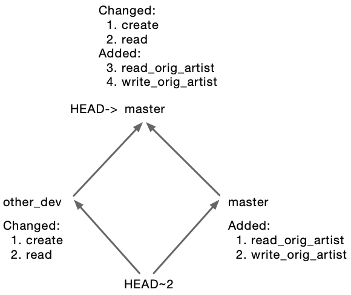

# Assignment 7&mdash;Continuous integration, Git branches, and testing

## Introduction

This assignment demonstrates the combined use of adjacent but related tools/practices:

* **Git branches**, which support development along multiple independent  paths by several developers;
* **Static checking**, which ensures that a system's code conforms to syntax, style, and safety requirements;
* **Testing frameworks**, for developing a broad, repeatable test suite;
* **Development platforms**, such as GitHub, which provide a central site to merge changes from several developers; and
* **Continuous integration (CI)**, which reduces the risk that merged changes introduce defects.

This list is incomplete&mdash;each tool supports additional use cases and outcomes beyond that showcased in the assignment, while comparable tools exist to achieve the same goal(s)&mdash;but this assignment introduces representative example for each.  

The common practice of Continuous Integration (see also [Reading 9](https://scp756-221.github.io/course-site//#/r9)) helps a team to achieve a number of goals:

* validate the program conforms to some level of performance/correcteness;
* maintain compliance to style/formatting requirements;
* does not include inappropriate code sequences (e.g., access keys and tokens) or known faulty code sequences (e.g., vulnerabilites).

By scrutinizing all code commits via several different technologies, CI provides high confidence that the code will be defect-free when it is deployed.

Rather than requiring you to do *all* the programming for this assignment, we are providing most of the code. You will be responsible for applying the updates. We want you to focus on the steps of the process and how the tools work together rather than losing yourself in Python code. You will get a chance to do a little coding at the very end of the assignment. 

The assignment considers the case of collaboration between several developers. But unlike Assignment 5 which involved other students, you will complete this assignment individually. That is, you will take on both roles: yourself and the other developer (named "Other Dev").

### The scenario

Our scenario for this exercise is that you and Other Dev have been assigned to add a new feature to the music service, an "original artist" field.  The current service only stores a single artist for every song but many songs have been performed by more than one artist. This new feature adds a new field to the song record to store the artist who performed the song previously. This design is rudimentary and far from adequate (e.g., we'd need to able to store an arbitrary number of previous artists) but it is sufficient for this assignment.

The music microservice API currently has three calls:

* `/` [HTTP POST]: Create a record with an artist name and song title.
* `/<music_id>` [HTTP GET]: Read the record for the song identified by `<music_id>`, returning its artist name and song title.
* `/<music_id>` [HTTP DELETE]: Delete the record for the song identified by `<music_id>`.

Other Dev will add an "original artist" field to the create and read calls, while the delete call will remain unchanged.

Your task is to add two new calls, focused on the new field:

* `/write_orig_artist/<music_id>` [HTTP PUT]: Write a name into the `orig_artist` field of the song identified by `<music_id>`. If there is already a name in that field, it is overwritten.
* `/read_orig_artist/<music_id>` [HTTP GET]: Read the `orig_artist` field of the song identified by `<music_id>` and return just that name (not the whole record).

After you're both done, the change sets will be combined and the complete feature can be deployed for clients.

## Part 1: Add your changes

The first part is to make "your" change: add the two API calls. This requires extending the code in three files:

1. The API itself: `s2/v1.1/app.py` implements the music API.
2. Clients that call the API: `ci/v1.1/music.py` is a library providing a simpler interface to the music API, representing it as a Python object whose member functions correspond to API calls.
3. Tests: `ci/v1.1/test_music.py` tests the music API, calling it via `s2/v1.1/music.py`.

We have provided 2 additional versions of these files. To summarize:

Original Source | Your Change | "Other Dev"'s Change |
:- | :- | :- |
`s2/v1.1/app.py` | `s2/v1.1/a7_self_app.py` | `s2/v1.1/a7_other_app.py`|
`ci/v1.1/music.py` | `ci/v1.1/a7_self_music.py` | `ci/v1.1/a7_other_music.py`|
`ci/v1.1/test_music.py` | `ci/v1.1/a7_self_test_music.py` | `ci/v1.1/a7_other_test_music.py` |

Your task is to replace the existing files (column 1) with those from "Your Change" (column 2). In the tools container command line, execute:

~~~bash
/home/k8s # cd s2/v1.1
/home/k8s/s2/v1.1 # cp a7_self_app.py app.py
/home/k8s/ci/v1.1 # cd ../../ci/v1.1
/home/k8s/ci/v1.1 # cp a7_self_music.py music.py
/home/k8s/ci/v1.1 # cp a7_self_test_music.py test_music.py
~~~

This is a good time to review the changes made to the three files using whichever tool you prefer: `diff`, `git diff`, GitHub Desktop, or the version comparison feature of Visual Studio Code. Examine the code to determine what has been added and/or modified. This will be part of your submission.

### Previewing the CI tests locally

We'll get into the details of CI tests later in this assignment but for now we'll just say that they are designed to be run on a central server such as GitHub, rather than locally. Nonetheless, it's good practice to test-run them locally when you can, fixing any errors quickly before running the slower server-based version.

You run the CI tests locally via the `runci-local.sh` script:

~~~bash
/home/k8s/ci/v1.1# cd ..
/home/k8s/ci# ./runci-local.sh v1.1
... extensive output ...
~~~

The output is copious; here's the part to focus on:

~~~
test            | ============================= test session starts ==============================
test            | platform linux -- Python 3.8.6, pytest-6.2.5, py-1.11.0, pluggy-1.0.0
test            | rootdir: /code
test            | collected 1 item
test            | 
cmpt756db       | 172.24.0.5 - - [29/Dec/2021 19:30:45] "POST /api/v1/datastore/write HTTP/1.1" 200 -
cmpt756s2       | 172.24.0.6 - - [29/Dec/2021 19:30:45] "POST /api/v1/music/ HTTP/1.1" 200 -
cmpt756db       | 172.24.0.5 - - [29/Dec/2021 19:30:45] "GET /api/v1/datastore/read?objtype=music&objkey=86988f80-f214-4e01-a73d-8289f87cd633 HTTP/1.1" 200 -
cmpt756s2       | 172.24.0.6 - - [29/Dec/2021 19:30:45] "GET /api/v1/music/86988f80-f214-4e01-a73d-8289f87cd633 HTTP/1.1" 200 -
cmpt756db       | 172.24.0.5 - - [29/Dec/2021 19:30:45] "DELETE /api/v1/datastore/delete?objtype=music&objkey=86988f80-f214-4e01-a73d-8289f87cd633 HTTP/1.1" 200 -
cmpt756s2       | 172.24.0.6 - - [29/Dec/2021 19:30:45] "DELETE /api/v1/music/86988f80-f214-4e01-a73d-8289f87cd633 HTTP/1.1" 200 -
test            | test_music.py .                                                          [100%]
test            | 
test            | ============================== 1 passed in 0.47s ===============================
~~~

Highlighting some key parts:

The test output is bracketed by summary output from the [pytest](https://docs.pytest.org/en/6.2.x/goodpractices.html#test-discovery) framework, listing the number of files found with a `test_` prefix, the total tests found in those files, and a breadcrumb trail comprising one dot for every test run.

The middle test output should look familiar: logs from the `cmpt756s1` and `cmpt756db` services, which you saw in earlier assignments.

If any tests had failed, we'd get a detailed report of the failure.

### Running the CI tests on GitHub

In this case, every test passed, so we can proceed to commit the updates and push them to GitHub. You can do this any way you prefer&mdash;using command-line Git, GitHub Desktop, or Visual Studio Code.  We'll show  the command line here below.  Recall that Git push operations are performed from your **host OS's** command line, not the tools container:

~~~bash
c756-exer $ git add s2/v1.1/app.py
c756-exer $ git add ci/v1.1/test_music.py ci/v1.1/music.py
c756-exer $ git commit -m 'Add *_orig_artist API calls'
c756-exer $ git push origin
~~~

Pushing commits to GitHub triggers any CI test set up for the updated files.  Our push modified files in `s2/v1.1`, which will initiate its corresponding CI test, [`.github/workflows/ci-system-v1.1.yaml`](https://github.com/scp756-221/c756-exer/blob/be16e6861cf3567f8f554b262e80cc3b7c8c56b4/.github/workflows/ci-system-v1.1.yaml#L8). (Note this link points to the template copy of the assignment repo and not your own repo. You can navigate to the comparable file in your repo if so desired.)

In your browser, open your repository in GitHub, using the URL `https://github.com/REGID/c756-exer`, where `REGID` is your GitHub userid. On that page, click on the `Actions` item in the top row menu, taking you to the "All workflows" page.

Locate the row titled, "Add *_orig_artist API calls" (or whatever subject line you gave the commit) inside the large table. It should be at or near the top of the list.

To the left of the row should be one of three icons:

* A pulsing orange circle:  The test is still running.
* A red X: The test failed.
* A green checkmark: The test succeeded.

Wait until the test has completed successfully and read the detailed test output:

1. Click on the title line, bringing up page with a box labelled `build`.
2. Click on the box, bringing up a list of headers with checkmarks on their left.
3. Click on the header labelled, `Run CI test`, opening up the (long) output from running the test.
4. Scroll down the output to find the test output highlighted from your local run, marked by `=======` bars.

You may be disinclined to read the output as this test succeeded. But practice doing so as this will be useful for when a test does fail.

## Part 2:  Add Other Dev's changes

You've made your changes and successfully pushed them to the central repository.  Now it's time to make Other Dev's changes.  Recall that Other Dev was asked to extend the *existing* API calls. Of course, in actual practice, Other Dev would do the following steps, not you, but for purposes of this assignment we ask you to do them. To simulate Other Dev working independently from you, you will now create a branch and make the change within that.  

### Roll the repository back to before your commit

We start with one step that might superficially seem odd: you will "time travel" to before you made your last changes. This is crucial because it is where Other Dev would have started--without your changes. Do not skip this step.

We achieve this "time travel"/rollback by jumping to the commit _before_ our last change, denoted by `HEAD~`. (The expresssion `HEAD~` above is known as tree-ish. Refer to this [post](https://stackoverflow.com/questions/4044368/what-does-tree-ish-mean-in-git) for details.)

~~~bash
/home/k8s/ci/v1.1 # git checkout HEAD~
~~~

If you examine your files, you will find they are as they were before your changes. For example, `music.py` no longer has your implementation. (The prefix `>` indicates content present in the second file (`a7_self_music.py`) but not the first (`music.py`).)

~~~bash
/home/k8s/ci/v1.1 # diff music.py a7_self_music.py
54a55,77
>     def write_orig_artist(self, m_id, orig_artist):
>         """Write the original artist performing a song.
...
>         return r.status_code
> 
83a107,134
>     def read_orig_artist(self, m_id):
>         """Read the orginal artist of a song.
> 
>         Parameters
...
>         item = r.json()
>         return r.status_code, item['orig_artist']
> 
~~~

### Start a fresh branch named `other_dev`

Now create the branch and make Other Dev's changes there.  

~~~bash
/home/k8s/ci/v1.1 # git checkout -b other_dev 
~~~

### Perform Other Dev's updates

Now repeat the commands you performed in Part&nbsp;1, only this time using the `a7_other_dev_*` files, which contain Other Dev's updates:

~~~bash
/home/k8s # cd s2/v1.1
/home/k8s/s2/v1.1 # cp a7_other_app.py app.py
/home/k8s/s2/v1.1 # cd ../../ci/v1.1
/home/k8s/ci/v1.1 # cp a7_other_music.py music.py
/home/k8s/ci/v1.1 # cp a7_other_test_music.py test_music.py
~~~

Again, examine the code to determine what has been added and/or modified in this second half of the feature. This will be part of your submission.

Once you've made these changes, repeat the steps that completed Part&nbsp;1:

1. Run the CI test locally and check that it succeeds.
2. Commit and push the updates
3. Review the new CI output on GitHub.

## Interlude: The levels of the CI tests

At this point, let's pause and consider all the components invoked during a local CI tests. This outline shows the components called by `runci-local.sh v1.1`.  Lines at the same indentation are called in sequence while an indented line is called as a function or subservice.  The implementation language for each component is in parentheses:

* `runci-local.sh` (bash) Top-level script
  * `docker` (Go) Client (from inside `clear-ci-images.sh`)
    * `dockerd` (Go) Server managing container images
  * `runci.sh` (bash) Mid-level script
    * `flake8` (Python) Static code checker
    * `docker-compose` (Go) Manage services and networks
      * `ci_test` (Python) Application running `pytest` framework
        * `test_music` (Python)) Test collection
          * `music.py` (Python) Client library for Music service
            * [via HTTP] `cmpt756s2` (Python) Music service
              * [via HTTP] `cmpt756db` (Python) Database interface layer
                * [via HTTP] `DynamoDB` (Java) Data storage layer

That's 12 components, written in 4 languages, organized in 9 layers (indentation level) for our simple application. Real-world cloud-based microservice architectures will have far more components than this. How do we know which ones to change when we want to update the system?

The layered design is key. For any given change, you need to

1. Locate the layer that needs to implement that change;
2. Update the callers of this layer if the API was changed;  
3. Add a test of the change.

It's not always this simple.  Complicated changes often cut across several layers but the basic principle remains the same, with every change requiring at least two changes (the layer and a test) and perhaps a third (the caller).

For the simple changes that you and Other Dev made, the relevant layers and their files were:

1. The extensions were made to the `cmpt756s2` layer, the music service, in file `s2/v1.1/app.py`.
2. Because the music service's API changed, you also had to modify the client library, in file `ci/v1.1/music.py`.
3. The tests are in the `test_music` layer, in file `ci/v1.1/test_music.py`.

Both you and Other Dev have updated these files but the updates were independent.  We need to consider how these independent updates are recorded in the repository.

## The repository state: Two developers, two branches, two updates

So far, the update has gone well.  You and Other Dev have made your updates, they have passed their tests, and the code has been pushed to the central repository.  Both your local repository and the GitHub repository will have this structure:

The left branch, which Other Dev created, extends two original API calls with the new field, while the right branch, created by you, adds two new calls.

To complete the feature, we need to merge the two sets of changes, giving our repos this structure:

**Note:** The bottom commit is now referenced by `HEAD~2` because it is **two** steps earlier than the current `HEAD`, the `master` branch.

Both sets of changes update the same three files (`test_music.py`, `music.py`, and `app.py`). We need versions of those files that incorporate both change sets.

## Part 3: Merge your changes with Other Dev's changes

The Git operation to merge two branches is appropriately named, "merge".  We want to merge Other Dev's branch into `master`, so we make `master` active by checking it out, then run `git merge other_dev`:

~~~bash
/home/k8s # git checkout master
/home/k8s # git merge other_dev
~~~

Although you and Other Dev modified the same files, the changes did not overlap by functions. The changes are sufficiently distinct that git can combine them automatically without your intervention. (If the changes overlapped by lines of code, you would need to manually review and reconcil the changes.)

Now repeat the familiar sequence:

1. Run the CI test locally and check that it succeeds.
2. Commit and push the updates
3. Review the new CI output on GitHub.

Are you satisfied with the work?

Seriously, don't just read ahead&mdash;think about this! Is there anything that might have been missed between the two implementations? (Now's a good time to review the code changes you observed earlier!)

## Part 4: Write a test that calls both

Although we have verified that each developer's changes work *individually*, we haven't tested whether they work *together*.  We haven't run an *integration test* which brings the two halves of the features together.

For such a test, we'll need a song with at least two previous artists.  (Why?)  Leonard Cohen's "Hallelujah" is an excellent candidate, a song so frequently covered that both [USA Today](https://www.usatoday.com/story/life/entertainthis/2016/11/11/best-covers-leonard-cohens-hallelujah/93636800/) and [NME](https://www.nme.com/blogs/nme-blogs/leonard-cohen-hallelujah-covers-1846415) have published guides to the best versions.  We'll go with an all-Canadian roster for our test: k.d. lang, Rufus Wainwright, and Cohen himself.
And this time, we're asking you to write the test. To get you started, here's the skeleton to add to `ci/v1.1/test_music.py`:

~~~python
def test_full_cycle(mserv):
    # `mserv` is an instance of the `Music` class

    # Performance at 2010 Vancouver Winter Olympics
    song = ('k. d. lang', 'Hallelujah')
    # Soundtrack of first Shrek film (2001)
    orig_artist = 'Rufus Wainwright'
    # Original recording from album "Various Positions" (1984)
    orig_orig_artist = 'Leonard Cohen'

    # Create a music record and save its id in the variable `m_id`
    # ... Fill in the test ...

    # The last statement of the test
    mserv.delete(m_id)
~~~

You shouldn't change any other file or add any other routines to this file. Review the other tests in `test_music.py` and the function documentation in `music.py` for ideas.  How can you verify that your changes and Other Dev's work together?

Once you've written your test, repeat the now-familiar sequence of first running locally, then committing and pushing it to GitHub. 

### Static code checking

Now that you are writing code, we can introduce a common component of CI, *static checking*. The first step in our CI sequence is to run the [Flake8](https://flake8.pycqa.org/en/latest/) static Python code checker on the submitted code. This tool examines your Python code *statically* (without running it) and looks for patterns in the syntax. It enforces a common style and checks for insecure and unreliable code sequences. When Flake8 finds such sequences, it describes them (including the line number) and fails the CI run.

The Flake8 messages appear near the beginning of the CI output.  A successful run will look like:

~~~
Checking flake8 conformance ...

Code conforms.
~~~

while an unsuccessful run will look like:

~~~
Checking flake8 conformance ...
v1.1/music.py:51:20: E251 unexpected spaces around keyword / parameter equals
v1.1/music.py:51:22: E251 unexpected spaces around keyword / parameter equals
v1.1/music.py:54:80: E501 line too long (114 > 79 characters)

Code does not conform---CI fails.
~~~

Your code must completely pass the Flake8 check to be accepted.  Correct any style errors and rerun the test.

When your code passes the style check and runs the test, what happened?

## Part 5: Fix the defect

Your test (should have) failed. If your newly added test did not failed, review the original code changes and revise your test code accordingly. **Be sure to screen-capture this failure for submission.**

The features worked individually but not together.  It turned out there was a disagreement between you and Other Dev on the field name. You had used `OrigArtist` while Other Dev had used `orig_artist`. Change your code to use `OrigArtist` as a field name instead of `orig_artist`."

Make the required changes to `ci/v1.1/music.py` and `s2/v1.1/app.py`.  Do not change your test in `test_music.py`. It's fine. Although we commonly say, "the test 'failed'", in fact it *succceeded* when it detected an error.

Once you've corrected the code, run the tests locally, and once they all pass, commit the changes and push them to GitHub.

The assignment is done when the **GitHub page** shows a green check for the latest run of this test. **As before,screen-capture this success for submission.**

## Epilogue:  Is this a realistic scenario?

This scenario and our simple application are contrived, simplified to keep your workload manageable. Could this kind of inconsistency arise in practice? This is a categorical yes. The amount of details in actual systems makes problems more likely, not less.  Organizations adopt many techniques to reduce the incidence of such inconsistencies but cases inevitably slip through.

Test. Check. Use the system wherever possible.

Continuous integration tools are a basic tool of this process. They don't solve the problem by themselves but careful, considered and deliberate application of them keeps the team/product/system on track. 

## Submission

Create a PDF file and answer questions 1-4. There's no need for an essay for either question 1 or 2. But your answer should be grammatically correct with proper spelling and punctuation. Keep each answer short and to the point: 75 words max.

1. Summarize what the first half of the original artist feature (as supplied to you in `ci/v1.1/a7_self_music.py`) does. Do not merely copy/paste function signatures; rather, outline the added/changed functionalities and highlight important implementation details. 

2. Summarize what the other dev's half of the original artist feature (as supplied to you in `ci/v1.1/a7_other_music.py`) does. Do not merely copy/paste function signatures; rather, outline the added/changed functionalities and highlight important implementation details. 

3. Screen-shot from GitHub Action showing the failed run of your `test_full_cycle` after integration. You must show clearly the failure as bounded by `==== FAILURES ====` and the fail/pass counts.

4. Screen-shot from GitHub Action showing a successful run of your `test_full_cycle` after correcting your code. You must show clearly the full run bounded by the `==== test session starts ====` and the summary of 3 successful tests.

5. Your implementation of `test_full_cycle`.

Submit the PDF as the first component `answer.pdf` to [Assignment 7](https://coursys.sfu.ca/2022sp-cmpt-756-g1/+a7/) in CourSys.

Submit your implementation of `test_full_cycle` as the second component.
