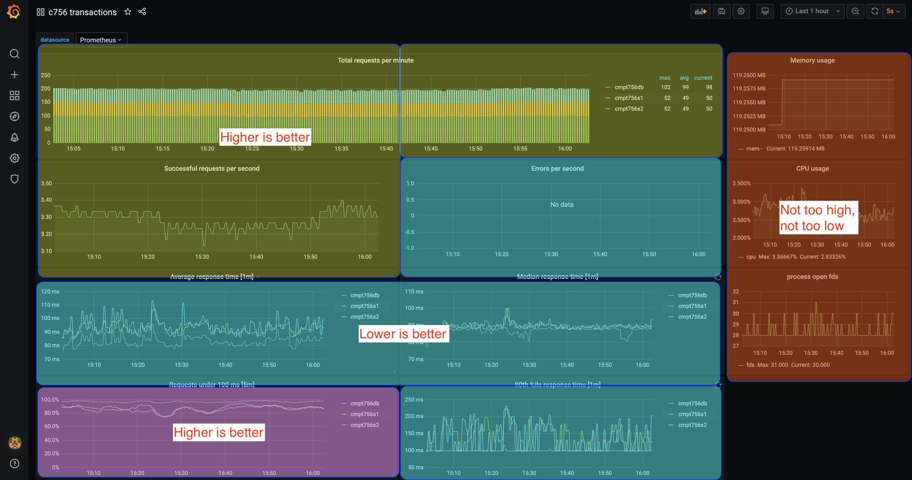

# Guide 1&mdash;Grafana

## Introduction

This Guide builds on the assignments to date by walking you through the Music application.

### New components

To date, we've been working in an environment in
which we can *run* our application but is ultimately a black box. We
have no way of looking inside and monitoring its performance,
detecting incipient problems and locating opportunities to
improve performance.

In this guide, we will introduce tools for gathering *metrics* and
displaying *dashboards*.  We will drive the system using a *load
tester* and use the dashboards to observe the changes in those
metrics as the load varies.

This series of guides (1-3) introduces a number of new tools:

* **[Gatling](https://gatling.io/)**: A load-testing tool for defining
  synthetic user behaviours and running those behaviours to load the
  system.
* **[Grafana](https://grafana.com/):** A tool for creating and running dashboards:
  arrangements of statistics, tables, and plots that summarize the
  current state of a distributed system.  Grafana queries Prometheus
  to retrieve the statistics it will display.
* **[Prometheus](https://prometheus.io/docs/introduction/overview/):**
  A system for gathering and storing metrics as a *time-series
  database*. Prometheus also features a limited query interface for
  *ad-hoc queries*. We will dig deeper into Prometheus in [Guide 2]().

Putting all these components together, we have this architecture:

## Setup

### 1. Environment Considerations

As with previous assignments, this guide is useable with AWS EKS or any Kubernetes services.

### 2. Clone the course repo and cd to e-k8s

You can start with a copy of the repo from Assignment 2 or later. If you are cloning a new copy, remember to transfer
your `tpl-vars.txt` and re-instantiate the templates before starting out.

## Provisioning the system

You will begin by creating a new cluster on AWS. (You can explore Azure and GCP as your interest/skill dictates.)

TODO: You will still run Gatling on your local machine.

### 2. Start a new cluster

Create a new cluster by running

~~~
$ make -f VENDOR.mak start
~~~

where `VENDOR` is one of `mk` (Minikube), `az` (Azure), `eks` (Amazon),
or `gcp` (Google), depending upon where you want the new cluster to
run. Creating new cluster takes typically 15+ minutes so be patient. The default context that is 
created is rather verbose; the `start` target renames it to a shorter `aws756`. 

### 3. Ensure AWS DynamoDB is initialized

Regardless of where your cluster runs, it will use AWS DynamoDB
for its backend database. Check that you have the necessary tables
installed by running

~~~
$ aws dynamodb list-tables
~~~

To create/delete these tables by way of AWS' CloudFormation (AWS' IaC technology):
~~~
# create a stack that encapsulate the 2 tables
$ aws cloudformation create-stack --stack-name <SomeStackName> --template-body file://path/to/cluster/cloudformationdynamodb.json 
# delete the stack
$ aws cloudformation delete-stack --stack-name <SomeStackName>
~~~

The resulting output should include the tables `User-<your-Github-id>` and `Music-<your-Github-id>`.

### 4. Provision the cluster

A fresh cluster simply includes the Kubernetes components. Installing
the course sample application and the components required is called *provisioning*.

Kubernetes uses a `namespace` to organize applications. Begin by creating a namespace `c756ns` and setting it as the default (to save typing/specifying it):
~~~
$ kubectl create ns c756ns
$ kubectl config set-context --current --namespace=c756ns
~~~

Assuming that your new cluster is in the current Kubernetes context,
provision it with the single command:

~~~
$ make -f k8s.mak provision
~~~

This command will take a while, particularly in the loop to install
Kiali. These steps can take five minutes or more, with a new `not yet
Created/not yet Running` message printed every second, so they can
consume a lot of screen space. Be patient!

Kiali won't be needed until [Guide 3](); watch for it when the focus shifts to `istio`.

### 5. Print the Grafana URL

Test that all the steps worked by printing the URL of the
Grafana dashboard (you will only get one of the following lines,
depending upon where your cluster is running).

If using Minikube, bring
up the gateway (``minikube tunnel`` where you have `sudo` rights) or set up an
appropriate port-forwarding tunnels (``kubectl -n c756ns port-forward pod/<podname> <port-ext>:<port-int>``).

~~~
$ make -f k8s.mak grafana-url
http://35.197.120.255:3000/                                                          # Sample output for most cloud providers
http://a3a64fbacc7114a028faa18b4a710f87-1707422240.us-west-2.elb.amazonaws.com:3000/ # Sample output for Amazon
~~~

Copy this URL and paste it into your browser. You will see the Grafana
signon page.

---

## Overview of Grafana dashboard

Sign on to Grafana with the following parameters:

* User: `admin`
* Password: `prom-operator`

After signon, you will see the Grafana home screen. Navigate to our
dashboard by hovering on the "Dashboards" icon on the left:

Select "Browse" from the menu. This will bring up a list of
dashboards. Click on `c756 transactions` (it should be at or near the
top of the list).

The initial dashboard will mainly read "no data", with only a few
panels displaying anything.  We'll fill the rest in a moment, when we
run Gatling to load the system, but for now orient yourself to the
types of displays:

The dashboard summarizes three broad categories of performance:

* Performance of our application's microservices (top left). The top
  plot shows total requests / minute, broken down by microservice. The
  two plots beneath it break the total requests down into sucesses
  (response code 200) and errors (response code other than 200). The
  two lower plots report requests / second; their sum multiplied by 60
  will equal the total at the corresponding time in the top plot.

* Latencies of the microservices (lower left).  These plots
  categorize the latencies in four ways: average, median (50th
  percentile), 90th percentile, and proportion under 100&nbsp;ms. The
  average and median indicate the centre of the latency distribution,
  while 90th percentile indicates the distribution's higher range. The
  proportion under 100&nbsp;ms indicates how well we are meeting our
  Service Level Objective (SLO).

* System utilization (right hand side). The three plots on the right
  show our application's current utilization of memory, CPU, and Linux
  file descriptors (fd). These values are the totals for all three
  microservices and do not include the memory, CPU, and fds used by
  Kubernetes, Prometheus, Grafana, and all the other management and
  monitoring tools in the cluster.  As such, the values in these
  plots are best seen as *relative* measures rather than absolutes:
  Consider how they change with varying load but do not focus on their
  absolute values.

**Acknowledgement:** This dashboard is derived from the
  [flask transaction dashboard](https://grafana.com/grafana/dashboards/9688)
  of [Dmitriy Onishko](https://grafana.com/orgs/dabster). We modified
  it to query the services in the CMPT&nbsp;756 sample application.

For any metric, we need to know the direction that is "good"&mdash;when
the plot heads that way, performance is improving.  The "good" direction
varies with the plot and does not exactly correspond to the three
categories of report:

Plots that we want to increase:

* Total requests / min
* Successful requests / s
* Proportion below 100&nbsp;ms

Plots that we want to keep low:

* Error requests / s
* Average, median, and 90th percentile latency

Plots that we want to keep in a middle zone:

* Utilization of memory, CPU, and file descriptors

This last point may need elaboration. The underlying computational
resources upon which our cluster runs represent an ongoing expense. On
the one hand, low utilization suggests there is an over-provisioning of capacity for the workload. But if utilization gets too high, the likelihood of a system failure increases dramatically (e.g., depletion of temporary file space, operating system process table, etc).

We want to keep system utilization at a medium level, neither too low
nor too high, to balance costs against the risk of sudden system
overload.

### Four types of time intervals

When interpreting metrics and their display on a dashboard, we need to
distinguish four different types of time intervals:

1. The sampling interval: Prometheus samples the current metric values
   of every system component every 30&nbsp;s. (This is configurable;
   30&nbsp;s is a common choice.)  Note that components will be
   sampled at different times.  Prometheus simply guarantees that
   adjacent samples from any single component will be 30&nbsp;s apart.

2. Aggregation interval (also called aggregation window): For a
   time-based aggregation such as rate or increase per unit time, how
   many samples are included in the aggregate.  For example, in the
   average latencies plot each point is the average rate of requests
   over a one-minute interval.  Therefore, given our sampling interval of
   30&nbsp;s, each average would typically be over 2 samples.  We will
   see in the next guide how to specify an aggregation interval in a
   Prometheus query.

   Every plot of an aggregate specifies its interval in the title,
   suffixed in square brackets: `[1m]`. In our dashboard, most
   aggregates have one-minute intervals, except for "Requests under
   100&nbsp;ms", which has a five-minute interval.  Metrics that are
   simply current values, such as memory usage, do not have an
   aggregation interval.

3. Display update interval: The interval between successive queries to
   Prometheus, which in turn are plotted as single points. The inverse
   of this interval is the display rate.

4. Display history interval: How long a period is represented by a
   plot.

The sampling interval and aggregation interval parameters are rarely
changed. In contrast, you will often alter one or both display
parameters to zoom in or out in your view of the system's performance
history.

We will return to this topic in a moment, when we begin analyzing our
system's performance under load.

### Caution: Team structure drives dashboard design

Dashboard design is a
[complex and controversial subject](https://www.realworlddevops.com/episodes/understanding-observability-and-monitoring-with-christine-yen). We
do not propose our sample dashboard as an ideal or even good summary
of our classroom application. Ultimately, the success of a production
system is determined by the
[structure of the teams developing and operating it](https://teamtopologies.com/). The
organization of that team or teams, together with the organization of
the other services with which ours interact, will drive the design of
any dashboards for it.

This dashboard is simply an example of the *kinds of information* that
might be displayed, providing you an opportunity to interpret them and
to extend it in your term project.

## Giving our services an initial load

Now we will begin to send load to the system, simulating user
interactions. We will start small, with just one user each querying
the user service (`s1`) and the music service (`s2`).

To create this load, you will use Gatling via an image that has been prepared for you: `ghcr.io/scp-2021-jan-cmpt-756/gatling:3.4.2`. (The source `Dockerfile` is available [here](https://github.com/tedkirkpatrick/kubernetes-testbed/tree/master/e-k8s/tools/gatling).)

### Start Gatling simulating two users

Gatling is a sophisticated tool that allows you to define scenarios of
user behaviour, using a programming language
[derived from Scala](https://gatling.io/docs/current/quickstart/). You
then run Gatling, specifying how many simulated users will follow each
scenario.

We have provided two scenarios (Gatling calls them simulations) for you. The source code is supplied at
`gatling/simulations/proj756/ReadTables.scala`:

* `ReadUserSim`: Call `s1` to read a user, then wait 1&nbsp;s before
  trying again
* `ReadMusicSim`: Call `s2` to read a music entry, then wait 1&nbsp;s before
  trying again

The simulations uses three parameters:
* `CLUSTER_IP` - the DNS name of your cluster
* `USERS` - the number of users to simulate
* `SIM_NAME` - selects either `ReadUserSim` or `ReadMusicSim` to choose between either of the microservices. 

Each simulation runs in an infinite loop until it is stopped (`docker container stop`). (There is also a 'bulk kill' script `tools/kill-gatling.sh`.)

To start Gatling, create a script `gatling-1-music.sh` that contains the following:

~~~
#!/usr/bin/env bash
docker container run --detach --rm \
  -v ${PWD}/gatling/results:/opt/gatling/results \
  -v ${PWD}/gatling:/opt/gatling/user-files \
  -v ${PWD}/gatling/target:/opt/gatling/target \
  -e CLUSTER_IP=`tools/getip.sh kubectl istio-system svc/istio-ingressgateway` \
  -e USERS=1 \
  -e SIM_NAME=ReadMusicSim \
  --label gatling \
  ghcr.io/scp-2021-jan-cmpt-756/gatling:3.4.2 \
  -s proj756.ReadMusicSim
~~~

(Note the use of the `--label` option; this is used by `tools/kill-gatling.sh` to quickly identify these containers.)

Note the selection of ReadMusicSim is indicated via the `SIM_NAME` variable as well as the simulation name (`proj756.ReadMusicSim`).

As this is using `--detach`, you will have no output; use `docker container ls`/`docker logs` to review the progress. (Alternately, remove the `--detach` and run this in an extra terminal.)

In either case, the logs will look similar to 

~~~
Simulation proj756.ReadMusicSim started...

================================================================================
2021-02-14 23:50:12                                           5s elapsed
---- Requests ------------------------------------------------------------------
> Global                                                   (OK=4      KO=0     )
> RMusic 0                                                 (OK=1      KO=0     )
> RMusic 1                                                 (OK=1      KO=0     )
> RMusic 2                                                 (OK=1      KO=0     )
> RMusic 3                                                 (OK=1      KO=0     )

---- ReadMusic -----------------------------------------------------------------
[--------------------------------------------------------------------------]  0%
          waiting: 0      / active: 1      / done: 0     
================================================================================
~~~

To stop `gatling`, use `tools/kill-gatling.sh`. Note that this scripts stops all accumulated/running simulations.

**Check for success:**  In the logs, check for two things to
  ensure that the command succeeded:

1. The rightmost column should read `KO=0`, indicating no requests
   failed.
2. The last line should have `waiting: 0`, indicating all your users
   have successfully begun making requests.

If one of these conditions does not hold, check that your cluster is
running, that your Internet connection is live, and that you correctly
entered one of the two scenario names.

Revisit the instructions above to start a second run of 1 user for `ReadUserSim`.

Your logs will look similar to:
~~~
Simulation proj756.ReadUserSim started...

================================================================================
2021-02-14 23:45:23                                           5s elapsed
---- Requests ------------------------------------------------------------------
> Global                                                   (OK=4      KO=0     )
> RUser 0                                                  (OK=1      KO=0     )
> RUser 1                                                  (OK=1      KO=0     )
> RUser 2                                                  (OK=1      KO=0     )
> RUser 3                                                  (OK=1      KO=0     )

---- ReadUser ------------------------------------------------------------------
[--------------------------------------------------------------------------]  0%
          waiting: 0      / active: 1      / done: 0     
================================================================================
~~~

### View the effects on the dashboard

Return to the Grafana dashboard. Now that we have a light load on the
system, all the panels with the exception of "Errors per second" should have data. For
such a light load, we will not have any errors, so this is expected.

Scan all the panels to get a sense of what a lightly-loaded system
looks like. Change the display history interval (near top right) from
"Last&nbsp;1&nbsp;hour" to "Last&nbsp;5&nbsp;minutes" to zoom in for a
detailed view of the last five minutes.

The variation of some metrics may at first seem dramatic. Pay attention to
the vertical scales of the plots, however&mdash;they will be small, making even
minor changes seem pronounced.

Change the display update interval (absolute top right) from "5s" to
"15s" and see how the display slows down but the horizontal axes of
the plots remains the same.

Return the display update interval to "5s" so that you can see changes
immediately when you increase the load in the next steps.

## Medium load

Now we'll put a medium load on the system, adding ten users each for
services `s1` and `s2`:

Run/create scripts for medium loads `gatling-10-music.sh` and `gatling-10-user.sh`.

Be sure to check that `KO=0` and `waiting: 0`, indicating successful
starts.

You should now have four Gatling commands running, for a total of 22
users, 11 for each service.  

Before returning to the Grafana dashboard, make a prediction:  In
which direction will each plot have changed with the increased load?
How big will the changes be?

---

Then return to the dashboard and check your predictions.

## Heavy load

So far, we've been gentle on our service.  It should be able to handle
only 22 users without any errors.  Let's give it a heavy load.

Run two more Gatling jobs, each with 50 users.  Now
you should have *six* jobs running, for a total of 122 users.

Ask yourself: How big will the changes be to the panels on our
dashboard?

---

Now look at the dashboard and see how your predictions played out.
Pay attention to the vertical scales; several will have changed
dramatically.

Move your cursor over a plot. It will display the values of the
metrics at the time specified by your cursor.

Let this heavier load run for 10&nbsp;minutes. For all the cases we
have tried, at this point you should start seeing errors (a line will
appear on "Errors per second"). If in your case you do not see any
errors after 10&nbsp;minutes, run some extra Gatling jobs to increase
the load until you get an error rate in the range 5&ndash;10 errors
per second.

Let the system run for about 10&nbsp;minutes, until it has apparently
stabilized in its new state, including a low but positive rate of errors.

### What happened?

Initially the system handled the load but after a while it started
producing errors. *When the errors began, nearly every panel showed at
least a slight change, with many showing dramatic changes.*

What happened? To provide a detailed diagnoses, we will need to use a
tool that will be introduced in the next guide.  This is often the
case with dashboards: They highlight that a problem has begun
(better still, that a problem is *about to begin*) but often do not let us
diagnose exact causes.

You will find it useful to record your observations so far and selectively
hypothesize on potential causes/mechanisms.

1. What happened to total requests and successful requests when errors
   began to occur?
2. What happened to average, median, and 90th percentile response
   times when errors began to occur?
3. Which was more affected by errors, median or average response time?
   Why?
4. Which of the three services was less affected than the other
   two?
5. The "Requests under 100&nbsp;ms" plot took longer to stabilize than
   the other three response time measures. Why?
6. You may or may not see changes in the three right-hand system
   utilization panels when errors begin. Consider what they can infer from them.

## Clean up all running services

Once you have completed this guide, clean up all the running
services.

1. Delete all the Gatling jobs using the `tools/kill-gatling.sh` script. (You may find it useful to study how it works using Docker's `label` feature.)

  ~~~
  $ tools/kill-gatling.sh 
  happy_mayer
  serene_chatterjee
  pedantic_wescoff
  reverent_zhukovsky
  hopeful_jackson
  fervent_jennings
  $ tools/list-gatling.sh 
              Name  Users               Script
  $
  ~~~

2. Shut down the cluster on your cloud provider or Minikube:

	~~~
	$ make -f VENDOR.mak stop
	~~~

   where `VENDOR` is one of `mk` (Minikube), `az` (Azure), `eks` (Amazon), or `gcp` (Google).

## Summary

System operators often want a dashboard--a summary of system state at
a glance. Grafana is a tool for building dashboards summarizing
metrics gathered by Prometheus. Use the dashboard to get an overview,
then do specific queries to diagnose problems.

To ensure a system is reliable and to verify its performance, we
must test it under load. Gatling is a tool for generating loads at
different levels and observing the system's response. For a simpler
but less flexible tool, consider the
[Fortio](https://github.com/fortio/fortio) load tester.

## Next Steps

The insights provided by Grafana are useful but
Grafana would be even more useful if your application can output tailored metrics. In the next guide, you will explore Prometheus to understand how it manages and surfaces the data collected and how an application can leverage Prometheus to enable monitoring.

