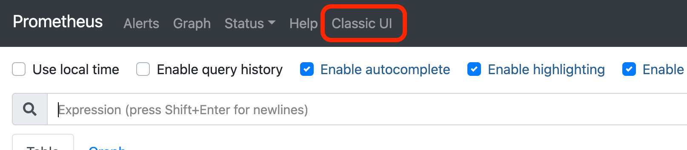

# Guide 2&mdash;Metrics and Prometheus

## Introduction

### New components

To recap the components introduced in the last guide:

* **[Gatling](https://gatling.io/)**: A load-testing tool for defining
  synthetic user behaviours and running those behaviours to load the
  system.
* **[Grafana](https://grafana.com/):** A tool for creating and running dashboards:
  arrangements of statistics, tables, and plots that summarize the
  current state of a distributed system.  Grafana queries Prometheus
  to retrieve the statistics it will display.
* **[Prometheus](https://prometheus.io/docs/introduction/overview/):**
  A system for gathering and storing metrics as a *time-series
  database*. Prometheus also features a limited query interface for
  *ad-hoc queries*.

## Setup

This guide picks up from [Guide 1](https://scp756-221.github.io/course-site//#/g1-graf/page?embedded=true&hidegitlink=true). You must have either worked thru that or otherwise arrived at a working/provisioned cluster before proceeding further.

## Prometheus Basics - Time Series

The Grafana dashboards as seen in Guide 1 provide an overview of a predefined set of
metrics. They're fine for monitoring the system but there are times we
want to query some different metrics.

The metrics in our system are in fact gathered by
Prometheus.  Grafana populates its dashboards by sending
predefined queries to Prometheus.

This guide explores querying
Prometheus directly as well as outputting metrics to Prometheus.  This latter capability will be useful when working
in your term project. Perhaps more importantly, learning Prometheus
will provide a better understanding of what metrics are and how they
are gathered.

### Basics of metrics and Prometheus

Prometheus serves two fundamental roles in a distributed
system. First, it gathers and records metrics in a
[time series database (TSDB)](https://en.wikipedia.org/wiki/Time_series_database),
which includes special compression techniques optimized for this type
of data. Second, it supports queries against that database.

A *metric* is a statistic measuring a basic facet of a system. For
example, our application records the metric
`flask_http_request_total`, the total number of HTTP requests matching
some criteria.  For each set or criteria, we get a different *time
series*.
Prometheus records time series at the finest possible granularity. For
example, it records separate time series of `flask_http_request_total`
for each container by each return status (200 vs. 404 vs. 500 ...).
As a result, most metrics will have many time series associated with
them.

Prometheus also records metrics in the most basic form possible. Our
example `flask_http_request_total` metric simply counts requests as
they arrive, increasing indefinitely without ever being reset. If you
want to compute the request *rate*, you must subtract the previous count
from the current value and divide by the elapsed time.  This
computation is done at the time of the query, not at the time the
metric was gathered.

Prometheus runs on the side, using these techniques to gather
metrics at the finest level of detail, incurring the least possible
computational overhead. The design strives to be as complete yet as
unobtrusive as possible.

Prometheus also supports queries. It features a query language,
[PromQL](https://prometheus.io/docs/prometheus/latest/querying/basics/),
that meets the specific needs of time series data. In particular, the
syntax enforces restrictions inherent to that type of data. Upon first
encounter, this language may seem confusing, preventing simple
queries. With experience, you will find that those "simple queries"
would have produced nonsensical results.

### Prometheus technical details

1. In this guide, I have written about "Prometheus" as a single
   component. In fact, the system comprises a server, an alert
   manager, multiple add-ons, adapters, and extensions, and client
   libraries. Each component has its own configuration file, with the
   configuration of the core Prometheus server being especially
   complex.
2. The set of metrics available from a given container is determined
   by that container, not Prometheus. There is no set of metrics
   guaranteed to be present for every system, though some
   configurations are so common that their metrics are nearly
   universal.
3. The set of metrics available from our three microservices are
   defined by the Python client library we use, the
   [Python Prometheus Flask exporter](https://pypi.org/project/prometheus-flask-exporter/).
   You are welcome to define new metrics for your term project.
4. The Prometheus "server" is itself two containers operating
   collaboratively. One gathers and records metrics, the other
   monitors changes to the Prometheus configuration.
5. A single Prometheus server can become a bottleneck. Larger systems may
   shard their metrics across multiple servers. Integrating these
   shards to gather system-wide metrics is complex.
6. In addition to its roles of storing metrics and supporting queries,
   Prometheus can play an optional third role, supporting Kubernetes
   as it varies the number of service replicas in accord with rises
   and falls in demand. Prometheus does this by providing
   [custom metrics](https://github.com/kubernetes/community/blob/master/contributors/design-proposals/instrumentation/custom-metrics-api.md)
   to a Kubernetes
   [Horizontal Pod Autoscaler](https://kubernetes.io/docs/tasks/run-application/horizontal-pod-autoscale/). We
   have not installed this feature in our simple application.
7. By default, Prometheus stores the raw metrics, leaving further
   processing to queries. But if a given query will be recomputed
   often, an installation can define
   [recording rules](https://prometheus.io/docs/prometheus/latest/configuration/recording_rules/)
   to precompute the query result at the time metrics are stored,
   saving their recomputation on repeated queries.

## Issuing basic Prometheus queries

With that background, you are prepared to issue some basic Prometheus
queries. Print out the Prometheus URL for your cluster by running:

~~~
$ make -f k8s.mak prometheus-url
http://20.48.136.216:9090/
~~~

Copy the printed URL and paste it into a new tab in your browser. You
will see a simple query interface with a text box for for queries.

### Listing Prometheus's many metrics

**Prometheus was updated in March with a new UI. Click on the "Classic UI" button on the top bar to revert 
to the Classic UI for this guide.** 

Begin by listing all the metrics available from Prometheus for your
system. Click on the dropdown list labelled,

	"- insert metric at cursor -"

This will reveal a list of all the available metrics, typically
running to the hundreds.

That's a *lot* of metrics. For the rest of this guide, we will
focus on just one, `flask_http_request_total`.

### A query returning a single time series

Enter the query `flask_http_request_total{service="cmpt756db"}` and
press return. This requests the *current values* of all time series
that have their `service` label assigned the string `cmpt756db`.

If you look at the upper right hand corner, in small type you will see
"Total time series: 1".  This query returned a single time series.

Below your query will be a two-column table. The `Element` column, on
the left, will list all the labels/value pairs associated with this
time series.

~~~
flask_http_request_total{container="cmpt756db",endpoint="http",
instance="10.244.1.10:30002",job="cmpt756db",method="GET",namespace="c756ns",
pod="cmpt756db-79ddc5446d-2566f",service="cmpt756db",status="200"}
~~~

(It will actually display in a single long line; I have wrapped it to better
fit this document format.)

The `instance` and `pod` labels will have values specific to your
cluster.  The other labels should be the same.

The right hand column (which you might have to scroll right to even
see), `Value`, is the most recent count of HTTP requests to the
database service since the current pod was started.

Copy the count value and then reissue the query by pressing the blue
`Execute` button.  The number in the `Value` column will have
increased, showing the number of HTTP requests issues since your
previous query.  This value will continue to increase as long as the
pod is running and receiving HTTP requests.

### Instant vector: A query returning multiple time series

Strip the last query back to its most basic form, requesting any time
series for our sample metric, regardless of the values
for its keys: `flask_http_request_total`.

This query will return 3 or more series, the number depending upon
how many services returned status `500` when you stress-tested the
system earlier in this guide.

This query result, representing a slice of values at one instant, is
called an *instant vector*. Note that the returned values were not
necessarily sampled at the same time but are simply the most recent
samples returned for each time series.

### Range vector: A query returning several values from a single series

Our next query will return to the single time series but we will ask
for all the samples over a given time range, returning a *range
vector*. Enter the query
`flask_http_request_total{service="cmpt756db"}[5m]`.  The `[5m]`
suffix requests all samples from the most recent 5 minutes, ordered
from oldest to most recent. Given that
our sampling interval is 30&nbsp;s, at most we might get 10
answers. This is typical, though you might only get 9 if the oldest
sample arrived a bit before the interval began.

The entries in the `Value` column will now include both a count and a
timestamp, separated by an `@` symbol.  The timestamp is in seconds
since January 1, 1970, GMT. Copy one of the timestamps and paste it
into the [Unix epoch converter](https://www.epochconverter.com/) to
decode the time into something more understandable.

Compare two adjacent timestamps from the series. You'll see that they
are separated by 30&nbsp;s, the Prometheus sampling interval.

### Multiple range vectors

As you might expect, we can run a query requesting ranges for multiple
time series. Try `flask_http_request_total[5m]`. This will return the
same number of time series as when you did the instant vector query,
but each result will itself be a range vector.

Compare the timestamps of the most recent values for several
series. You will see that timestamps for different services, say
`cmpt756s1` and `cmpt756db`, will be different because Prometheus
"scrapes" their metric values at different times. Both will have a
consistent 30&nbsp;s refresh value, though.

### Counters do not increase when their events stop

If you have some series for the error code `status="500"` (you might not, if you
restarted everything after crushing the system), look at the counts in
`Value`. As long as you are submitting only a light load from Gatling
and no errors are occuring, the time series will continue but the
values will not change because no new errors have occurred in the last
five minutes.

If you do not have any time series of error returns, simply
skip this step.

## Matching query types to vector type

The PromQL language enforces the distinction between instant and range
vectors. Specifically,

* [Aggregation operators](https://prometheus.io/docs/prometheus/latest/querying/operators/#aggregation-operators)
  such as `avg` or `min` can only be applied to instant
  vectors.
* Functions that compute a value over time, such as `increase` or
  `rate`, can only be applied to instant vectors. The
  [list of PromQL functions](https://prometheus.io/docs/prometheus/latest/querying/functions/)
  specifies for each function whether a vector argument must be
  instant or range.

### Computing a rate across a range

Let's first see what happens when we ask for a rate at a single point
in time.  Execute the query
`rate(flask_http_request_total{service="cmpt756db"})`.  This produces
an error because it makes no sense to compute the change over time of
an instantanous value.

It does make sense to compute the rate of change over a range of
times. Try `rate(flask_http_request_total{service="cmpt756db"}[5m])`
(note that the `[5m]` goes *inside* the final parenthesis). The query
completes and returns a single value, the rate of HTTP calls per
second. Note that because the first value is the base count, the
denominator is only 270&nbsp;s, not 300. You can verify this by
subtracting the timestamp of the first value in the range from the
timestamp for the last.

Let's try one more query that will fail:  Try the query,
`avg(flask_http_request_total{service="cmpt756db"}[5m])`. Prometheus
will reject this because it does not make sense to average a series of
counts increasing over time. It only makes sense to compute the counter's
increase or its rate of change over time.

### Computing an average across an instant

Instant vectors have the opposite requirements to ranges: Operators
such as `avg` applied over an instant make sense, whereas functions
over time do not.

Try the query `avg(flask_http_request_total)`. It returns a single
value, the average number of HTTP requests per time series since each
series began.  This is a mathematically well-defined value but it's
not useful. It averages the series of successful responses (quite
high) with the series for error responses (quite low, so long as the
system is not overloaded).  It also averages the total for each
series, even though they might have begun at different times, such as
if a pod was restarted by Kubernetes.

The query that addresses these limits, coalescing all requests to each
service irrespective of their status, for the most recent 10&nbsp;minutes, is
significantly more complex:

	avg(sum without (status) (increase(flask_http_request_total[10m])))

We will not go into the details of this query. The main point is that
aggregate operators such as `avg` are subtle. Although Prometheus
prevents their use in ways that are mathematically nonsensical, many
permitted queries do not provide the insight that you might at first
think. Take great care when defining new metric queries. Compare the
results from Prometheus with back-of-the-envelope estimates of what
you expect them to be. If they differ from your estimates, review what
the query actually means.

## Clean up all running services

Once you have completed this guide, clean up all the running
services.

1. Stop any Gatling jobs you used to generate the traffic:

   ~~~
   $ docker ps --filter 'label=gatling'
   $ docker stop x_y a_b i_j ...
   # or
   $ tools/kill-gatling.sh
   ~~~

2. Shut down your cluster:

	~~~
	$ make -f VENDOR.mak stop
	~~~

    where `VENDOR` is one of `mk` (Minikube), `az` (Azure), `eks` (Amazon), or `gcp` (Google).

## Summary

To operate a distributed system, we need a view of the system's
internal state. That internal state is represented by
metrics. Prometheus is a widely-used system for gathering and storing
time series of metrics, with the PromQL language for querying
those series. One can issue ad hoc queries directly to Prometheus. But realistically, you are more likely to rely on dashboards as provided by Grafana to examine your system state. In production systems, other tools are
often used, such as [Datadog](https://www.datadoghq.com/),
[New Relic](https://newrelic.com/), or
[Honeycomb](https://www.honeycomb.io/).

## Next Steps

You have now seen how Grafana and Prometheus provide complementary capabilities for your application: the former to visualizing your system state and the latter to gather and store metrics to inform your system state. But however useful they are, you are still missing the forest for the tree because there is no place that surfaces the structure of the application: how do the various microservices call and rely upon each other.

Within the scope of this sample application, you are told that `s1` and `s2` both call
`db`, which in turn calls Amazon DynamoDB. But none of this is
represented in the dashboard. In a real-world application, one is faced with two situations: 1) where one microservice is dependent on a number of other  microservices; 2) there are layers of intervening calls between any two given microservices of interest. This dependency/usage graph that we see is both vital but neither available nor readily available. Indeed, the inherent challenge of a microservice architecture is the proliferation of services to achieve any meaningful outcome.

In the final guide, we will examine the service mesh `istio` and its console `Kiali` that will explicitly represent our microservice architecture and surface metrics
within that context.
